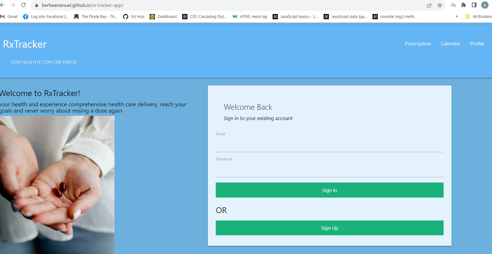
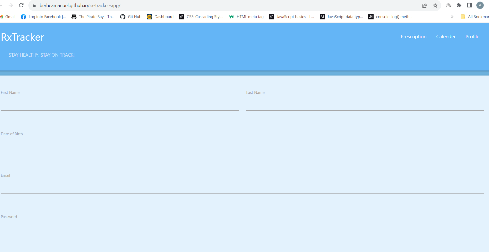
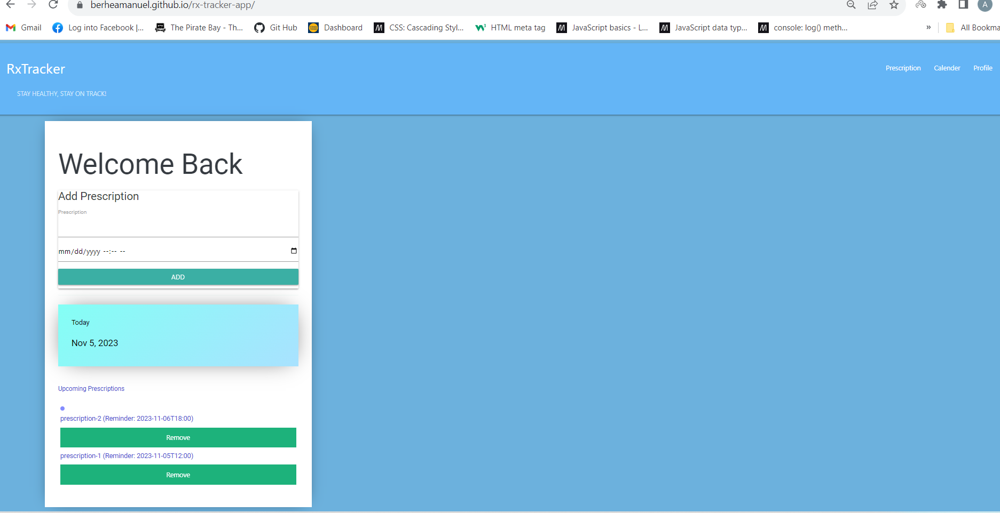

# RxTracker APP

## Description
Provides one-to-one guidance on nutrition, sleep, emotional well-being, movement, and medication
## User story
* As a user that takes prescription everyday, and struggles keeping up, I want to be able to track my prescription accordingly.

## Acceptance criteria
* WHEN I open the page
* THEN I can sign up or sign in to the page using email and password

* WHEN I sign in 
* THEN I am presented with a form to input my prescription type and set reminder 

* WHEN I input my prescription type 
* THEN I get a reminder on when to take it from the calendar provided 

* WHEN I take my  scheduled prescription
* THEN I am presented with a saved checklist of my session for the day

## Deployed Application Link
* https://berheamanuel.github.io/rx-tracker-app/

## Screenshot

## Reference

* https://www.passportjs.org/
* https://github.com/firebase/firebaseui-web
* https://firebase.google.com/docs/auth/web/start#web-namespaced-api_1
* https://firebase.google.com/docs/web/modular-upgrade#window-compat
